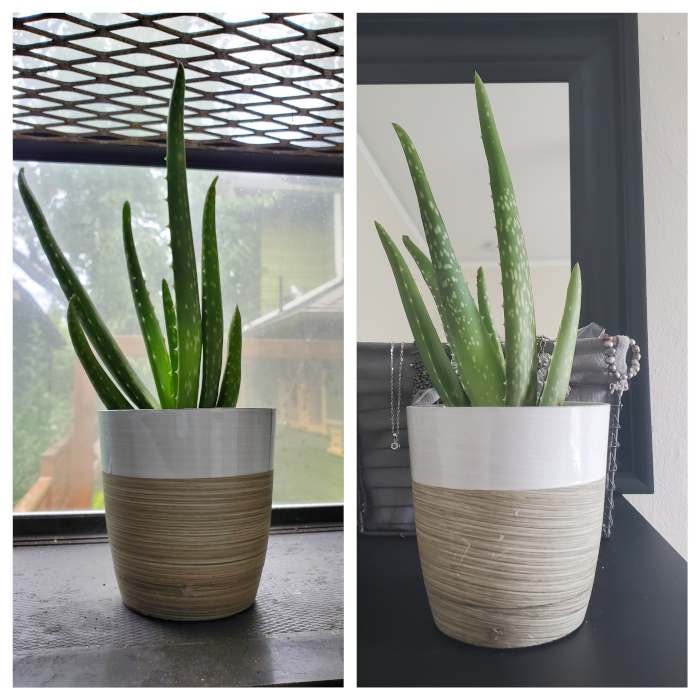

#### Aloe Vera | Aloe barbadensis

##### Description and Care

Aloe is a succulent that grows best in dry conditions and needs a lot of light. Allow soil to completely dry before watering again. Totally drench when watering.

##### Updates

**Aug 5: Welcome home Gemini!** These aloe plants came in a set of two from Costa Farms which I ordered on Amazon, and they arrived in great condition. For now I put one in my kitchen and the other in my bedroom. There's no direct sunlight, but it's incredibly bright in there so I'll keep an eye on it and hopefully it will be okay. Right now, they are sitting in the pots that other plants came with, but there are no drainage holes in them so its just to cover up the shipping pot they came in. Theyre super cheap and the paint is already scratching off of it, so eventually I'll get new pots to put them in, but I'll need special succulent soil for them first.
